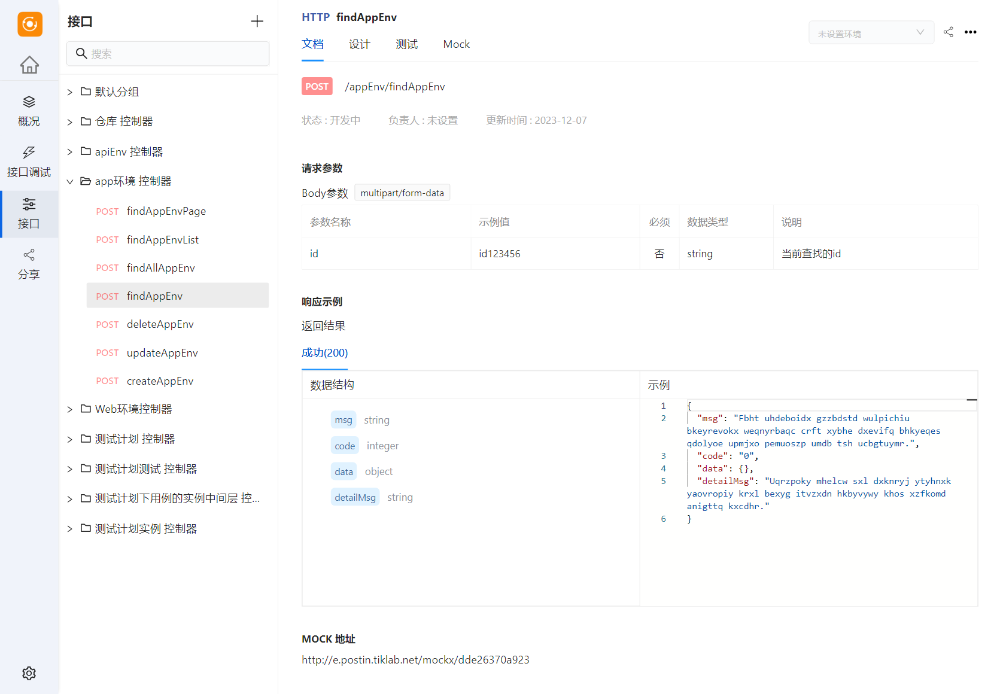
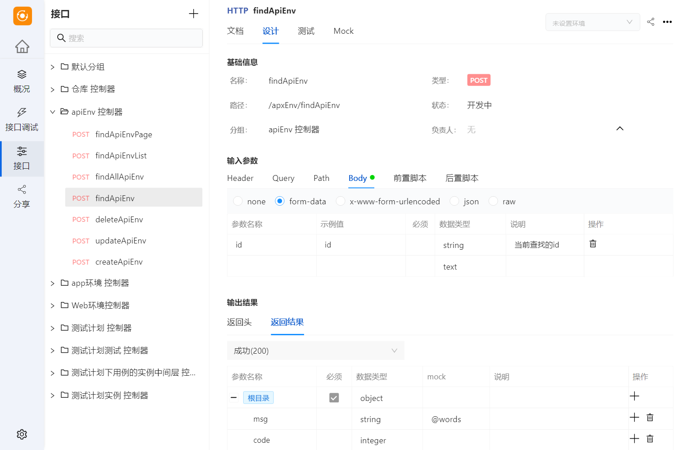
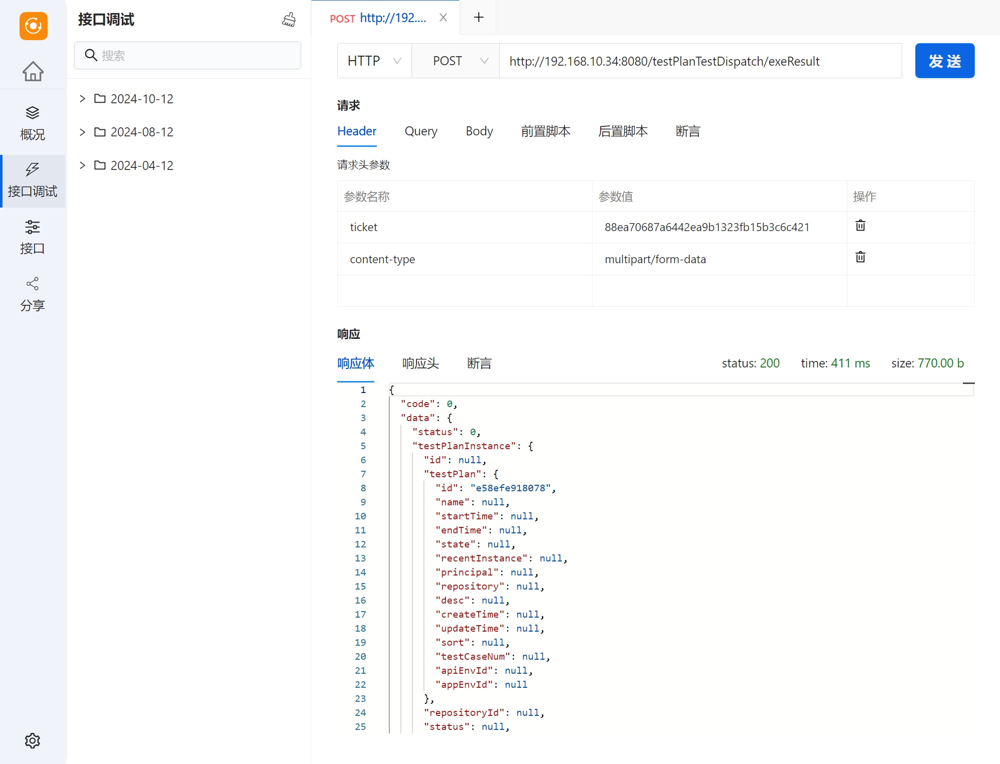

<h1 align="center" style="border-bottom: none">
    <a href="https://postin.tiklab.net/" target="_blank"></a><br>postin
</h1>

# Postin - 接口管理工具

随着 API 在现代开发中的广泛应用，Postman 等工具已成为接口测试和调试的必备。然而，随着项目规模的扩大和团队协作的复杂化，开发者们开始寻求更灵活且易于集成的解决方案。**Postin** 正是这样一款开源的接口管理工具，为团队提供从 API 设计到调试、接口文档和模拟数据生成的一站式解决方案，简化开发流程，提升协作效率。

## 主要功能

### 1. API 文档
Postin 自动生成详细的 API 文档，包含请求、响应、参数说明等信息，方便团队协作与分享。


### 2. API 设计
Postin 提供直观的设计界面，支持多种请求方法和参数配置，帮助团队轻松定义和管理接口。


### 3. API 调试
Postin 集成了强大的调试功能，允许开发者实时查看请求和响应数据，快速定位并解决问题。


### 4. MOCK 模拟数据
内置 MOCK 数据生成功能，前端开发人员可以在后端未完成的情况下，提前进行独立开发和测试。

## Postin的优势

- **简洁易用**：界面直观、操作简单，适合开发者快速上手，无需复杂配置。
- **开源免费**：Postin 是完全免费的开源工具，用户可以自由获取、使用并贡献代码。
- **多终端支持**：支持 Web 端和桌面端，适用于不同工作环境。
- **多版本支持**：提供公有云和私有部署版本，灵活适应不同企业和项目的需求。

## 下载与演示

了解更多关于 Postin 的信息，欢迎访问以下链接：

- [首页](https://postin.tiklab.net)
- [演示](https://postin.tiklab.net/demo)
- [下载](https://postin.tiklab.net/download)

Postin 致力于为开发者提供全面的接口管理解决方案，帮助团队提升工作效率并确保项目顺利进行。


## 运行 Postin

请确保你已经部署好所需的开发环境

**安装依赖**
```
npm install
```

**运行**
```
npm run start
```
