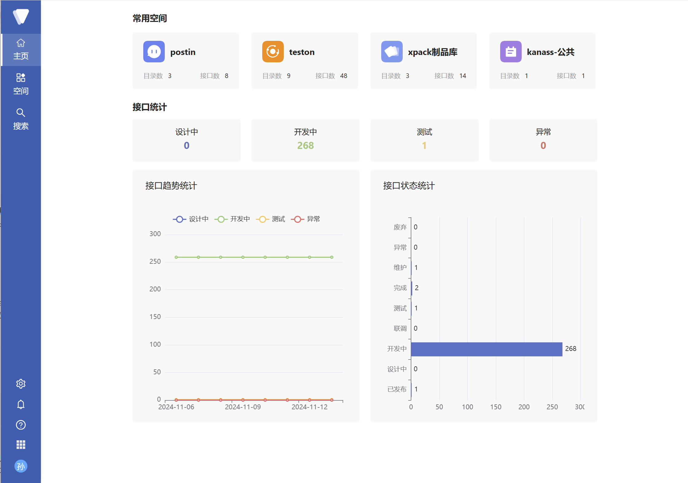
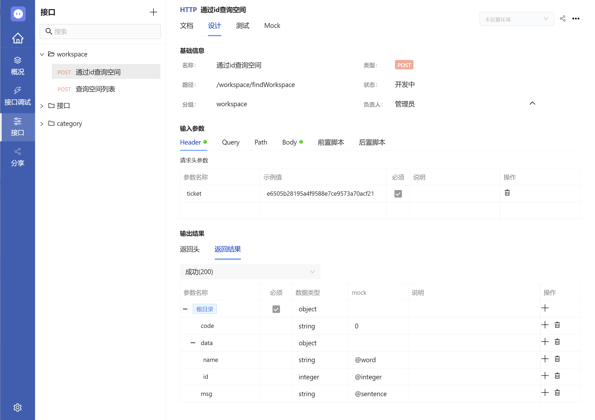
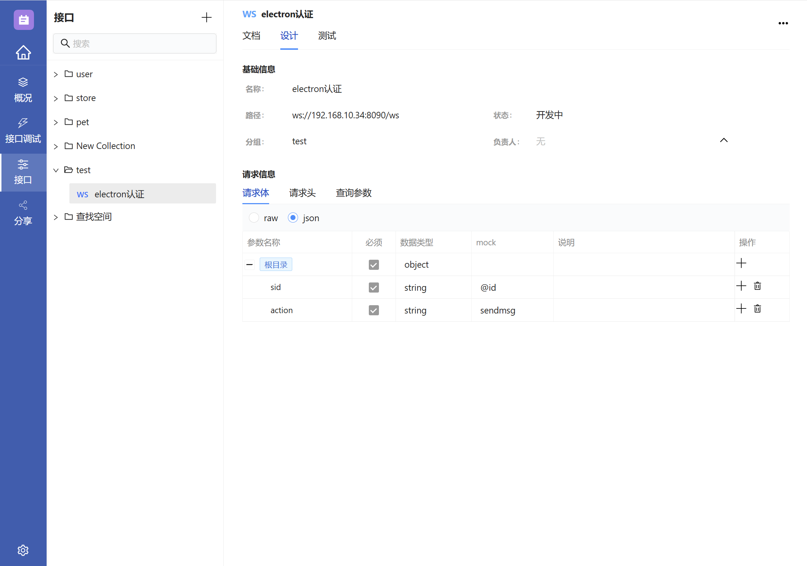
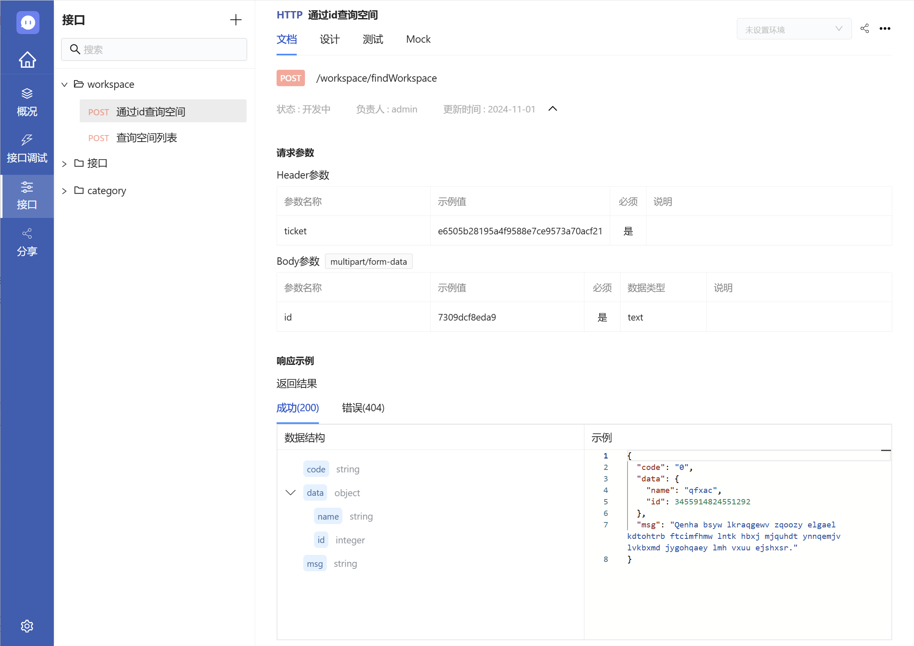
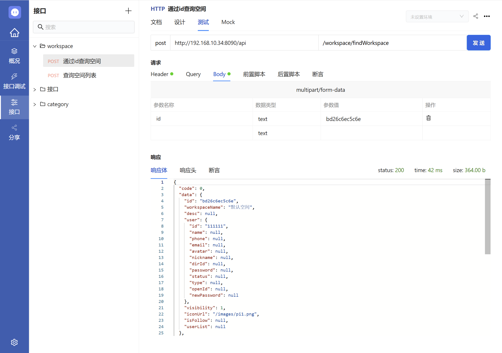
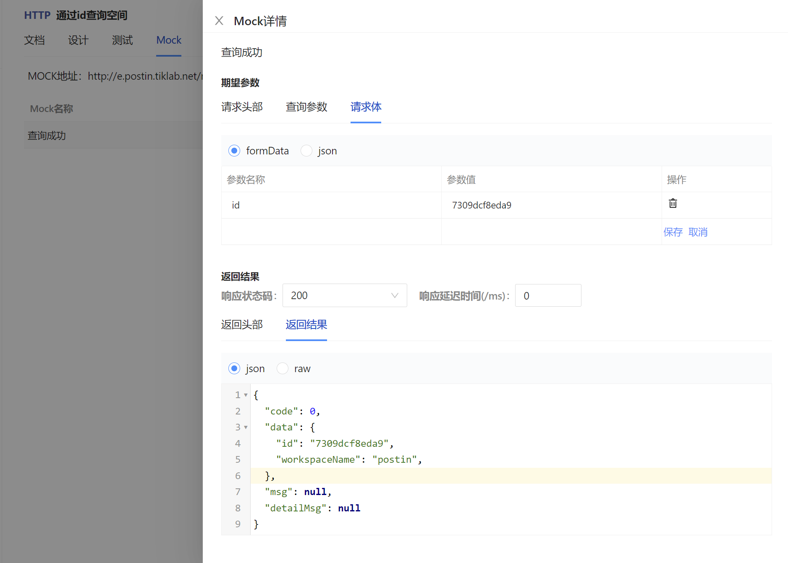
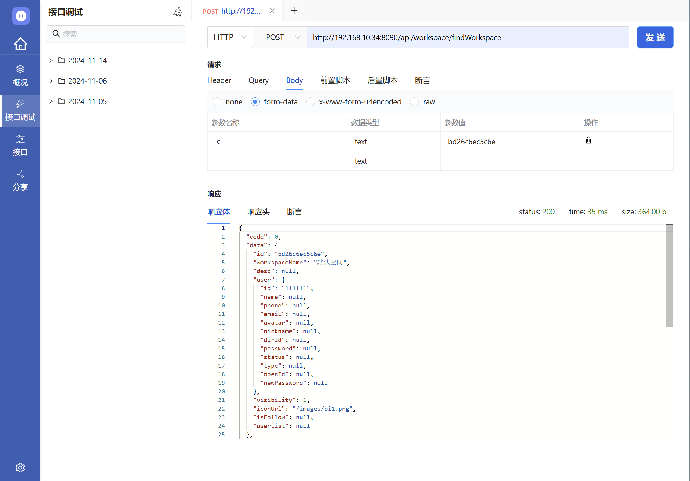
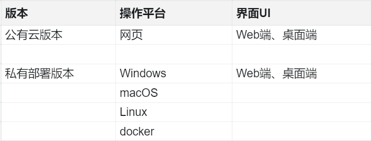

<h1 align="center" style="border-bottom: none">
    <a href="https://postin.tiklab.net/" target="_blank"></a><br>postin
</h1>

# Postin - 接口管理工具

在接口开发中，团队常常面临接口频繁变更和文档维护困难的问题。主流工具如 Postman 和 Swagger 虽能部分解决这些问题，但仍存在局限性。推荐一款开源免费的 API 管理工具 - Postin ，提供 API 设计、调试、文档生成和 MOCK 数据模拟等一站式解决方案，有效简化了开发流程，提升团队协作效率。

# 1. 主要功能

Postin 提供了一系列功能，包括空间管理、接口调试、接口管理和分享管理等，帮助团队高效管理和调试 API 接口，提升协作效率。

## 1.1. 空间管理

空间是 Postin 中最高级别的项目管理单元，用于帮助团队高效地组织和管理 API 资源。它作为一个独立的容器，可以容纳项目的所有 API 接口、文档、测试等资源。

- **基础管理**  
  帮助用户创建和管理不同的项目空间，方便团队根据项目需求组织 API 接口、文档及相关资源，确保项目资源的高效分类和管理。



- **环境**  
  支持管理多个环境配置（如开发、测试、生产），便于在不同环境中测试和验证 API。

- **模型**  
  提供对可复用数据模型的定义和管理，支持在多个 API 设计和调试过程中使用，确保数据的一致性和准确性。

- **统计**  
  提供项目进展和接口使用情况的跟踪，便于数据分析和优化决策。

- **成员**  
  便于项目成员的角色和权限分配，确保高效协作。

- **权限**  
  自定义项目权限设置，控制成员的操作权限，保障项目安全。

## 1.2. 接口管理

Postin 提供全面的接口管理功能，包括设计、调试、文档生成和 MOCK 等功能，支持 HTTP 和 WebSocket 协议，帮助开发者高效管理和测试 API 接口。

- **接口设计**  
  接口设计通过设置基础信息、请求和输出结果的参数，来构造当前接口的具体使用方式。支持多种协议，包括 HTTP 和 WebSocket，灵活适应不同应用需求。
  
  - **HTTP 协议**  
    HTTP 协议设计涵盖了基础信息、请求参数和响应结果的设计。



  - **WebSocket 协议**  
    WebSocket 协议设计涵盖了基础信息、请求参数的设计。



- **接口文档**  
  接口文档基于接口设计自动生成，确保接口信息实时更新，便于团队随时查阅和对接，支持 HTTP 和 WebSocket 协议，方便共享给其他开发者或团队成员。



- **接口调试**  
  接口调试功能基于接口设计自动生成数据，支持 HTTP 和 WebSocket 协议，帮助开发者快速验证和调试 API 接口。



- **MOCK 模拟数据**  
  Postin 提供内置的 HTTP 协议 MOCK 数据生成功能，支持前端在后端未完成时进行独立开发和测试，减少依赖，提升开发效率。



## 1.3. 快捷调试

Postin 提供快速便捷的接口调试功能，与接口管理中的接口区别在于需要手动输入参数，用于临时测试不需要管理的接口。支持 HTTP 和 WebSocket 协议，帮助开发者验证 API 接口的功能和行为，确保接口按预期工作。



## 1.4. 分享管理

用于管理分享后的接口文档，方便团队成员和外部开发者快速获取所需信息，促进协作。

# 2. Postin 的优势

Postin 的优势包括简洁的界面，私有部署一键安装，开源免费，支持多版本和多终端使用，保障数据安全和可靠性，具备强大的系统集成功能，满足不同开发团队的需求。

## 2.1 简洁易用

- **界面简洁**  
  直观的界面设计，结构清晰，让用户可以快速找到所需的功能模块。

- **安装配置简单**  
  私有部署支持一键安装，安装后即刻可用，无需额外配置。

## 2.2 安全可靠

- **多层级权限控制**  
  通过应用级、系统级和项目级权限管理，确保不同角色和成员在不同层次上获得恰当的访问权限，从而保障项目的安全性。

- **日志审计**  
  实时记录所有操作变动，便于追溯到具体用户和时间，确保操作透明。

- **备份与恢复**  
  定期备份数据，实时恢复，防止数据误删或损坏。

## 2.3 系统集成

支持导入 Postman、Swagger 和 OpenAPI 接口文档，实现与主流工具的无缝集成，简化接口管理流程。

## 2.4 多版本、多终端

支持不同版本的部署，可在多个平台和设备上使用，确保灵活性和兼容性，满足多样化的开发需求。



## 2.5 开源免费

免费开放源代码，支持社区协作和共享，推动项目不断发展和优化。


# 3、立即使用
了解更多关于 Postin 的信息，请访问以下链接：

- **演示**

    产品演示：https://postin.tiklab.net/demo

- **下载**

    私有部署版本下载：https://postin.tiklab.net/download

- **使用**

    公有云版本使用：https://postin.tiklab.net


## 运行 Postin

请确保你已经部署好所需的开发环境

**安装依赖**
```
npm install
```

**运行**
```
npm run start
```
